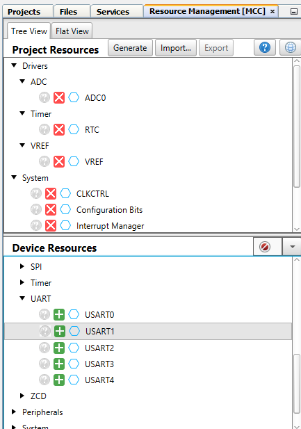
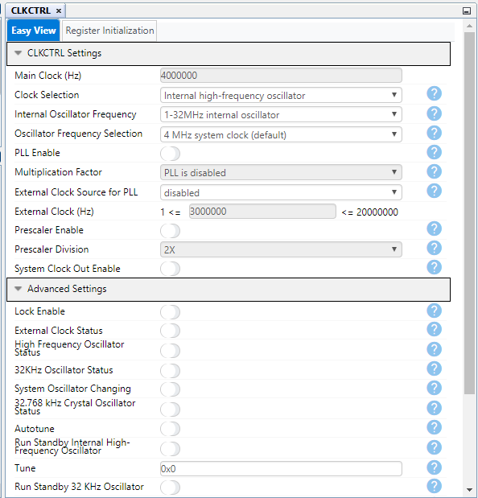
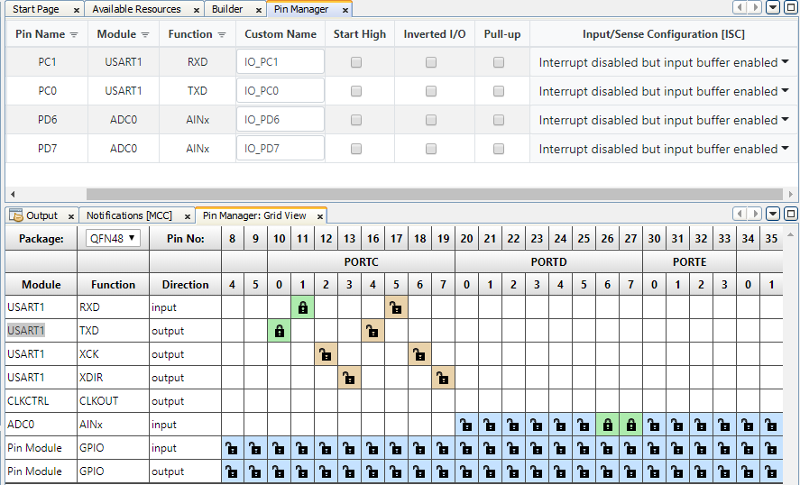

<!-- Please do not change this html logo with link -->

# AC voltage measurement using Differential ADC

## Introduction
The AVR128DA48 features one 12-bit differential ADC. Differential ADC is used to measure the voltage difference between the two input channels. This example demonstrates the AC voltage measurement using differential ADC.

**Note:** ***This example could be generated with all the pin variants of AVR DA family of microcontrollers. This example configuration is generated with the MCC(v5.3.0) framework***

## Useful links

- [AVR128DA48 Product Page](https://www.microchip.com/wwwproducts/en/AVR128DA28 "AVR128DA48 Product Page")
- [AVR128DA48 Code Examples on GitHub](https://github.com/microchip-pic-avr-examples?q=avr128da48 "AVR128DA48 Code Examples on GitHub")
- [AVR128DA48 Project Examples in START](https://start.atmel.com/#examples/AVR128DA48CuriosityNano "AVR128DA48 Project Examples in START")
- [ADC AC voltage measurement - Studio Example]( https://github.com/microchip-pic-avr-examples/avr128da48-adc-ac-voltage-measurement-mplab.git "ADC AC voltage measurement - Studio Example")

## Demo Description

  
   Fig 1: Block diagram view of the system used for AC voltage measurement 

In this demo,

* AC input to be measured is fed to the voltage stepdown circuit.
* Stepped down AC voltage is fed to the ADC +ve channel after offset voltage addition as shown in waveform in Fig 2  and reference offset voltage is given as input to the -ve channel of the ADC. 

  
   Fig 2: Waveform of AC signal input to the MCU 

* Periodic interrupt is used as a trigger for the ADC to start the conversion for every 500 microsecs delay. 
* After capturing the required number of samples, RMS voltage is calculated using the captured sampled result and the formulae used for calculation is 

  

  

* Calculated RMS voltage is displayed on terminal window through USART peripheral.

## Application code flow diagram

  
   Fig 3: Application Code flow diagram 

## Software used:

- [MPLAB® X IDE v6.05](https://www.microchip.com/mplab/mplab-x-ide "MPLAB® X IDE v6.05")
- [XC8 Compiler v2.41](https://www.microchip.com/mplab/compilers "XC8 Compiler v2.41")
- MPLAB® Code Configurator (MCC) v5.3.0
- MPLAB® Code Configurator (MCC) Core v5.5.0
- [AVR-Dx DFP 2.3.272](https://packs.download.microchip.com/ "AVR-Dx DFP 1.4.75")

**Note: For running the demo, the installed tool versions should be the same or later. This example is not tested with the previous versions.**

## Hardware used:

* AVR128DA48 Curiosity Nano Evaluation Kit [[Part Number:DM164151]](https://www.microchip.com/DevelopmentTools/ProductDetails/PartNO/DM164151 "[Part Number:DM164151]")

  
   Fig 4 : AVR128DA48 Curiosity Nano Evaluation Kit 

 

## Hardware setup:

  
   Fig 5 : Hardware setup 

 

  
   Fig 6 : Voltage stepdown block diagram 

 

  
   Fig 7 : Hardware connections diagram 

 

## Demo Operation

* Setup the hardware as shown in hardware setup section and in Fig 5.
* After the curiosity nano board is powered up, load the application firmware to AVR128DA48 microcontroller.
* Set the desired AC input voltage and frequency from the AC source and check the data displayed on terminal window.
* Some test data is shown in the below figures. For example : Set the AC input voltage to 50V and frequency to 50Hz and observe the measured RMS voltage displayed on terminal window as shown in Fig 8.

  
   Fig 8 : Observed output on terminal window for 50V AC input voltage and 50Hz frequency 

 

* Set the AC input voltage to 250V and frequency to 50Hz and observe the measured RMS voltage displayed on the terminal window as shown in Fig 9.

  
   Fig 9 : Observed output on terminal window for 250V AC input voltage and 50Hz frequency 

 

* Set the AC input voltage to 50V and frequency to 60Hz and observe the measured RMS voltage displayed on the terminal window as shown in Fig 10.

  
   Fig 10 : Observed output on terminal window for 50V AC input voltage and 60Hz frequency 

* Set the AC input voltage to 110V and frequency to 60Hz and observe the measured RMS voltage displayed on terminal window as shown in Fig 11.

  
   Fig 11 : Observed output on terminal window for 110V AC input voltage and 60Hz frequency 

## Conclusion : 

The demo provides an example of differential ADC application using the 12-bit ADC peripheral on the new AVR-DA family. For more details about the peripheral’s configuration refer Appendix MCC Project Configuration section. 

## Appendix: MCC Project Configuration

Configure ADC, RTC, VREF and USART peripherals through Microchip Code Configurator (MCC) v4.1.0 and generate MPLAB project.
### Steps for creating a new project
1.	Open **MPLAB X IDE** latest version.
2.	Go to **File---> New Project** (click).
3.	Select (Categories) **Microchip Embedded--->**(Projects) **Standalone Project**. (Press Next)
4.	Select Device---> Enter **Device name** (Microcontroller Part Number: in this project enter AVR128DA48) (Press Next).
5.	Select **Tool** is optional (Press Next).
6.	Select Latest **XC8 Compiler**. (Press Next).
7.	Enter **Project Name** and **File location**. (Press Finish).
8.	Click on **MCC** symbol to configure peripherals as shown in Fig 12

  
   Fig 12: MCC symbol on MPLAB X IDE 

9.	Add ADC, VREF, USART and RTC peripherals to the project .
* 	Click on Resource Management[MCC], located on top side of the window.
* 	To add peripherals to the project, select ADC, VREF, RTC, USART under Device Resources---> under Drivers, by clicking on (+) button as shown in Fig 13.
* 	All selected peripherals should be in Project Resources.

  
   Fig 13: Add peripherals in Project Resources 

### 10.	System module configuration:
* In Project Resources tab, Select CLKCTRL (Under System) and Select Easy View.
* The Internal Oscillator option is selected as a clock source and by default 4 MHz system clock is selected as Oscillator frequency as shown in Fig 14. 

  
   Fig 14: System module configuration window  

### 11.	USART configuration:
* USART 1 peripheral is used to transmit the measured AC voltage onto the terminal window. Configure the USART1 peripheral by following the steps as shown in the Fig 15.
* In Project Resources tab, Select USART 1 (under Drivers--->UART) and Select Easy View.
* Enable the Printf support option, which allows to print a sequence of characters.
* Set the Baud Rate to 9600.

  
   Fig 15: USART configuration window  

### 12.	RTC configuration:
* RTC is configured in PIT (Periodic Interrupt Timer) mode, which generates a periodic interrupt after every 500 microseconds . The periodic interrupt is used as a trigger for the ADC to start differential conversion . Configure the RTC peripheral by following the steps as shown in the Fig 16.
* In Project Resources tab, Select RTC (under Drivers--->Timer--->RTC) and Select Easy View.
* Select the Internal 32.768KHz oscillator option from the dropdown menu against the RTC Clock Source Selection field, which uses 32.768 kHz oscillator as a clock source for the PIT.
* Enable the PITEN Enable option to enable the periodic interrupt timer mode.
* Select the period RTC Clock Cycles 16 option from the drop-down menu against the Period Selection field which generates 500 microsec delay.
* Enable the Periodic Interrupt Enable option to generate periodic interrupt after specified delay.

  
   Fig 16: RTC configuration window  

### 13.	VREF configuration :
* VREF is configured to provide reference voltage for ADC peripheral. Configure the VREF peripheral by following the steps as shown in the Fig 17.
* In Project Resources tab, Select VREF (under Drivers) and Select Easy View.
* Enable the Enable Force ADC Voltage Reference option to enable the reference voltage for ADC peripheral.  
* Select the reference voltage VDD as reference from the drop-down menu against the ADC Voltage Reference Source.   

  
   Fig 17: VREF configuration window  

### 14.	Global Interrupt configuration: 
* To generate any interrupt like periodic interrupt, it is required to enable the Global Interrupt Enable.
* In Project Resources tab, Select Interrupt Manager (under System)---> Select Easy View.
* Check the Global Interrupt Enable option which enables global interrupt as shown in Fig 18.

  
   Fig 18: Global Interrupt configuration window  

### 15.	ADC configuration:
* ADC is configured in differential mode and it is used to measure the ac voltage of the input signal. Configure the ADC peripheral by following the steps as shown in Fig 19.
* In Project Resources tab, Select ADC0 (under Drivers)---> Select Easy View.
* Configure ADC in differential mode by enabling the Differential Mode Conversion field.
* Enable ADC option, which enables the ADC.
* Set the ADC sampling frequency to 125KHz.
* Enable the RESRDY: Result Ready Interrupt Enable option, which enables the ADC result ready interrupt.

  
   Fig 19: ADC configuration window  

### 16.	Pin manager configuration:
* Configure I/O pin PD6 as input to the positive channel of the differential ADC, where step downed voltage with offset addition is fed as input to this positive channel . 
* Configure I/O pin PD7 as input to the negative channel of the differential ADC, where reference voltage is fed as input to this negative channel.

  
   Fig 20: Pin manager configuration window 

